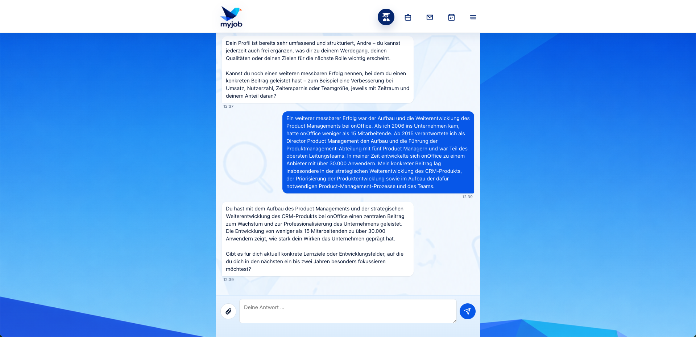
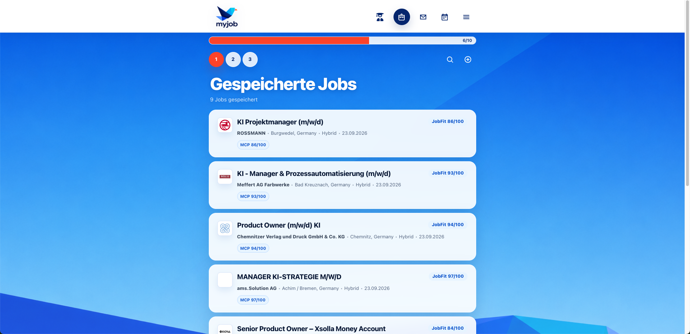
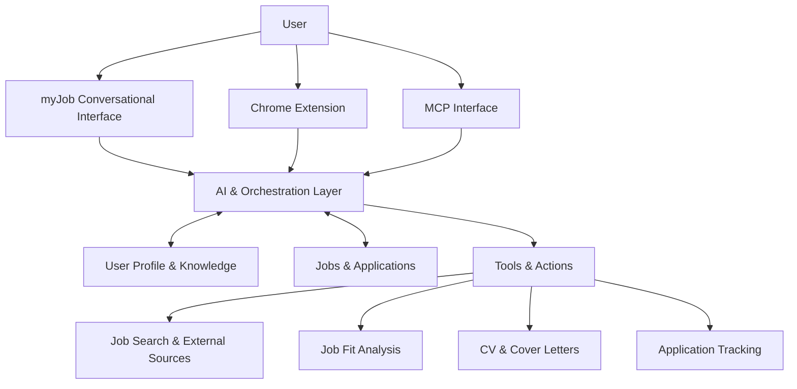

# myJob

### An AI-native approach to job searching

myJob is a personal project exploring a simple question:

**What if finding a job didn't start with a search form, but with a conversation?**

Instead of forcing users to translate their experience and goals into keywords, filters and job titles, myJob builds an understanding of the person first.

From there, AI supports the complete journey — discovering relevant opportunities, evaluating fit, preparing tailored application documents and keeping track of applications.

> The goal is not to add AI to a traditional job board.  
> The goal is to rethink the job-search experience around AI.

## Conversation first

myJob starts by understanding the person — not by asking for search keywords.

Through conversation, it builds persistent context about experience, achievements, preferences and goals. This context can later be used across job discovery, fit analysis and applications.

## What it does

myJob connects the individual steps of a job search into one AI-supported workflow.

- **Understands the user** — experience, skills, preferences, goals and development interests become persistent context.
- **Finds opportunities** — searches multiple job sources based on that context rather than relying only on fixed job titles.
- **Evaluates fit** — analyses opportunities and explains strengths, gaps and relevant aspects of the role.
- **Personalises applications** — adapts CV content and creates tailored cover letters without inventing experience or qualifications.
- **Tracks the process** — stores jobs and applications, detects duplicates and keeps the search organised.
- **Acts through tools** — AI can use application functions and external sources to perform multi-step workflows instead of only generating text.

The result is a job-search experience in which the user increasingly interacts with **one AI assistant instead of many disconnected tools and forms**.

## From conversation to action

The conversational interface is only one part of myJob. Information and actions are translated into a structured job-search workflow.

Jobs can be collected from different sources, evaluated against the user's profile and stored with their individual fit assessment. This allows the AI assistant to work with the same application data as the user.

## How it works

myJob is built around a shared user and application context that can be accessed through different interfaces.

The same product context can be used across different entry points:

- **Conversational interface** — users manage their job search through natural dialogue.
- **Chrome Extension** — jobs discovered on external job platforms can be transferred directly into myJob.
- **MCP interface** — AI assistants can access myJob tools and application context directly.
- **Shared context** — profile knowledge, jobs and applications remain available across workflows.
- **Tool-based actions** — the AI can search, analyse, create and update information instead of only generating text.

## Technology

myJob is a working web application that I design and build using AI-assisted development.

**Application**
- PHP · Laravel · JavaScript
- MySQL
- REST APIs

**AI & integrations**
- LLM APIs
- Model Context Protocol (MCP)
- Tool-based AI workflows
- Chrome Extension integration

**Development approach**
- AI-assisted coding
- Rapid prototyping and iteration
- Product discovery translated directly into working software

## Why I built it

myJob started from my own experience of returning to the job market after a longer break.

I quickly realised that AI was changing not only how people apply for jobs, but also the jobs themselves. New roles such as AI Product Manager, AI Builder or AI Transformation Manager often don't fit neatly into traditional job-title searches.

That led to the core product question:

**Can an AI understand a person well enough to continuously discover opportunities they might never have searched for themselves?**

myJob grew from that question into an experiment in rethinking the entire application journey — from understanding the person to finding opportunities, evaluating fit and preparing an application.
